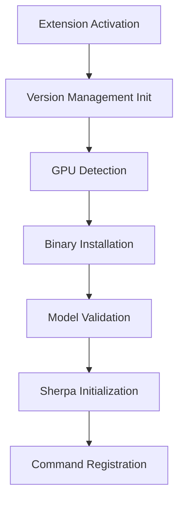

# TTS-STT Cursor Implementation Analysis

## Table of Contents
- [Overview](#overview)
- [1. Command Registration System Overhaul](#1-command-registration-system-overhaul)
- [2. State Management and Resource Flow Analysis](#2-state-management-and-resource-flow-analysis)
- [3. Implementation Recovery Analysis](#3-implementation-recovery-analysis)
- [4. WebView and Media Implementation Patterns](#4-webview-and-media-implementation-patterns)
- [5. Sherpa-ONNX Integration Patterns](#5-sherpa-onnx-integration-patterns)
- [6. Testing and Configuration Patterns](#6-testing-and-configuration-patterns)
- [7. Configuration System Analysis](#7-configuration-system-analysis)

## Overview

The TTS-STT Cursor Extension project aims to integrate Sherpa-ONNX's speech processing capabilities into the Cursor IDE using TypeScript and native Node.js bindings. This analysis documents the current state of implementation, working patterns, and areas requiring attention across several key aspects:

### Core Components
1. **Command Registration System**
   - Standardized command naming with `tts-stt-cursor` prefix
   - Simplified activation events
   - Comprehensive error handling
   - WebView panel management

2. **State Management**
   - Version state tracking
   - GPU capability detection
   - Model validation
   - Resource lifecycle management

3. **Platform Integration**
   - Cross-platform binary management
   - GPU acceleration support
   - Native binding integration
   - Resource cleanup procedures

### Implementation Status
- ✅ WebView implementation with security and resource management
- ✅ Media handling with error recovery
- ✅ Platform-specific code with fallbacks
- ✅ Test infrastructure with proper isolation
- ❌ Version compatibility validation
- ❌ Resource requirement checks
- ❌ User-friendly error messages
- ❌ Progress tracking implementation

This analysis serves as a comprehensive guide for understanding the current implementation state and planning future development efforts.

## 1. Command Registration System Overhaul

### Initial Trigger
The investigation began when command execution was failing with multiple issues:
- Commands defined in package.json were not being recognized
- Inconsistent command prefixes causing confusion
- Redundant activation events generating lint warnings
- Incomplete command implementation in extension.ts

### Issue Analysis
1. **Command Definition Issues**
   - Inconsistent prefixes (`tts-stt-cursor` vs `tts-stt`)
   - Redundant activation events in package.json
   - Missing command categories for test commands
   - Incomplete menu contributions

2. **Implementation Gaps**
   - Missing error handling in command handlers
   - Incomplete Sherpa initialization checks
   - No proper logging for command execution
   - WebView panel management needed improvement

### Solution Selection
We chose a comprehensive approach that:
1. Standardizes command naming and structure
2. Implements proper error handling and logging
3. Ensures Sherpa initialization before command execution
4. Simplifies activation events following VS Code best practices
5. Improves user feedback through information messages

### Implementation Details

1. **Package.json Updates**
   - Standardized all commands to use `tts-stt-cursor` prefix
   - Simplified activation events to only `onStartupFinished`
   - Added proper categorization for test commands
   - Organized menu contributions for better UI integration

2. **Extension.ts Improvements**
   - Added comprehensive error handling for all commands
   - Implemented Sherpa initialization checks
   - Added detailed logging through output channel
   - Improved WebView panel management
   - Added user feedback through information/error messages

### Anticipated Outcomes

1. **Immediate Benefits**
   - Cleaner command registration system
   - Better error handling and user feedback
   - Improved initialization reliability
   - Reduced lint warnings
   - More maintainable codebase

2. **Long-term Improvements**
   - More reliable command execution
   - Better debugging capabilities
   - Easier maintenance and updates
   - Improved user experience
   - Better extension stability

### Technical Details

1. **Command Registration Pattern**
```typescript
context.subscriptions.push(
    vscode.commands.registerCommand('tts-stt-cursor.commandName', async () => {
        try {
            // Initialization check
            if (!sherpaState.isInitialized) {
                await initializeSherpa(context);
            }
            // Command implementation
            // User feedback
        } catch (error) {
            // Error handling and logging
        }
    })
);
```

2. **Activation Event Simplification**
```json
{
    "activationEvents": [
        "onStartupFinished"
    ]
}
```

### Verification Steps
1. All commands properly registered during activation
2. Error handling catches and logs issues appropriately
3. User feedback provided for all command operations
4. Sherpa initialization checked before command execution
5. WebView panels properly managed

### Next Steps
1. Implement voice selection UI for TTS
2. Add more comprehensive testing for commands
3. Consider adding command telemetry
4. Document command usage in README
5. Add command keyboard shortcuts

This implementation provides a solid foundation for the extension's command system while following VS Code best practices and ensuring proper error handling and user feedback.

---

## 2. State Management and Resource Flow Analysis

### Initial Trigger
After resolving command registration issues, deeper analysis revealed complex interdependencies in the initialization and resource management systems:
- Multiple managers (Version, GPU, Model) with circular dependencies
- Complex initialization sequence requiring careful orchestration
- Resource cleanup procedures not fully documented
- State validation points scattered across different components

### Architecture Analysis

1. **State Management Components**
```typescript
// Core State Managers
InitStateManager     // Tracks initialization state
VersionStateManager  // Manages version compatibility
GPUManager          // Handles GPU detection and setup
ModelManager        // Manages model loading and validation
```

2. **Initialization Chain**


3. **Resource Management Points**
   - Binary Downloads: Managed by VersionManager
   - GPU Resources: Handled by GPUManager/GPUContext
   - Model Files: Controlled by ModelManager
   - Native Libraries: Tracked by InitStateManager

4. **State Validation Sequence**
```typescript
// Critical validation points
versionManager.validateVersionState()    // Version compatibility
gpuManager.checkGPUAvailability()        // GPU capability
versionManager.verifyInstallation()      // Binary integrity
modelManager.validateModels()            // Model availability
initializeSherpa()                       // Final initialization
```

### Key Findings

1. **Initialization Dependencies**
   - Version state must be validated before GPU detection
   - GPU detection affects binary selection
   - Binary installation required before model validation
   - All components must be ready before Sherpa initialization

2. **Resource Management Patterns**
   - Binary downloads use platform-specific paths
   - GPU initialization varies by platform (CUDA/Metal)
   - Model loading follows strict validation
   - Resource cleanup needs centralization

3. **Critical Paths**
   - Version validation → Binary selection
   - GPU detection → Binary type selection
   - Binary verification → Model loading
   - Model validation → Sherpa initialization

### Implementation Considerations

1. **State Management**
   ```typescript
   // Centralized state tracking
   class InitStateManager {
       private state: {
           versionValidated: boolean;
           binariesInstalled: boolean;
           modelsValidated: boolean;
           gpuInitialized: boolean;
       }
   }
   ```

2. **Resource Lifecycle**
   ```typescript
   // Resource management pattern
   async function manageResource() {
       try {
           // 1. Check state
           // 2. Initialize resource
           // 3. Track in state manager
           // 4. Setup cleanup
       } catch (error) {
           // Cleanup and state reset
       }
   }
   ```

### Binary Management Analysis

1. **Download/Validation Sequence**
```typescript
// Current sequence in ModelManager
async ensureModelsDownloaded(): Promise<void> {
    try {
        await this.scanModels();
        for (const model of this.availableModels) {
            if (!await this.validateModelPath(model.compressedPath)) {
                await this.downloadModel(model);
            }
            if (!await this.validateModelPath(model.extractedPath)) {
                await this.extractModel(model.compressedPath);
            }
        }
    } catch (error) {
        this.logger(`Failed to ensure models: ${error instanceof Error ? error.message : 'Unknown error'}`);
        throw error;
    }
}
```

2. **Resource Management Concerns**
   - Binary downloads not properly tracked in state
   - Extraction process lacks cleanup on failure
   - No temporary file management
   - Missing download progress tracking
   - Incomplete error recovery

3. **Identified Improvements Needed**
   - Centralize binary state tracking
   - Add download progress reporting
   - Implement proper cleanup procedures
   - Add validation checkpoints
   - Enhance error recovery

4. **Validation Points Required**
   ```typescript
   // Proposed validation sequence
   async validateBinarySequence() {
       // 1. Check version compatibility
       // 2. Verify platform requirements
       // 3. Validate GPU compatibility
       // 4. Check binary integrity
       // 5. Verify extraction success
       // 6. Cleanup temporary files
   }
   ```

### Resource Management Analysis

1. **Binary Management Chain**
   ```mermaid
   graph TD
       A[Version Check] --> B[Platform Detection]
       B --> C[Asset Selection]
       C --> D[Download Process]
       D --> E[Validation]
       E --> F[State Update]
       F --> G[Cleanup]
   ```

2. **Critical Resource Points**
   - Version State: Managed by VersionStateManager
   - Binary Downloads: Handled by APIService
   - GPU Resources: Controlled by GPUManager/Context
   - Model Files: Managed by ModelManager

3. **Validation Checkpoints**
   ```typescript
   // Key validation points
   async function validateResources() {
       // 1. Version compatibility
       await versionManager.validateVersionState(targetVersion);
       
       // 2. Platform compatibility
       const assets = await apiService.getCompatibleAssets(platform, arch);
       
       // 3. GPU availability
       const gpuAvailable = await gpuManager.checkGPUAvailability();
       
       // 4. Binary integrity
       await versionManager.verifyInstallation();
       
       // 5. Model validation
       await modelManager.validateModels();
   }
   ```

4. **Resource Cleanup Strategy**
   ```typescript
   // Cleanup procedure
   async function cleanupResources() {
       try {
           // 1. GPU cleanup
           await gpuContext.cleanup();
           
           // 2. Binary cleanup
           await versionManager.cleanupOldInstallations();
           
           // 3. Model cleanup
           await modelManager.cleanupExtracted();
           
           // 4. State reset
           await initStateManager.reset();
       } catch (error) {
           // Handle cleanup errors
           outputChannel.appendLine(`Cleanup failed: ${error}`);
       }
   }
   ```

### Implementation Recommendations

1. **State Tracking Improvements**
   - Centralize state management
   - Add validation checkpoints
   - Implement proper cleanup
   - Enhance error recovery
   - Add progress reporting

2. **Resource Management Enhancements**
   - Add download progress tracking
   - Implement temporary file management
   - Add validation checkpoints
   - Enhance error recovery procedures
   - Improve cleanup coordination

## 3. Implementation Recovery Analysis

### Working Components Identified

1. **WebView Implementation**
   ```typescript
   // Functional WebView pattern
   function createWebviewPanel(context: vscode.ExtensionContext, mode: 'STT' | 'TTS') {
       // Panel creation
       // Content security policy
       // Message handling
       // Resource cleanup
   }
   ```

2. **Media Handling**
   ```javascript
   // Working media recording implementation
   async function handleRecordingStart(stream) {
       mediaRecorder = new MediaRecorder(stream);
       // Audio chunk collection
       // Blob creation
       // Data transmission
   }
   ```

3. **Command System**
   ```typescript
   // Verified command pattern
   vscode.commands.registerCommand('tts-stt-cursor.startSTT', async () => {
       try {
           await initializeSherpa(context);
           await createWebviewPanel(context, 'STT');
       } catch (error) {
           // Error handling
       }
   })
   ```

### Integration Points

1. **Sherpa-ONNX Bindings**
   ```typescript
   // Working initialization pattern
   const recognizer = new sherpa.OnlineRecognizer({
       transducer: {
           encoder: paths.encoder,
           decoder: paths.decoder,
           joiner: paths.joiner
       },
       tokens: paths.tokens,
       featConfig: {
           sampleRate: 16000,
           featureDim: 80
       }
   });
   ```

2. **VS Code API Usage**
   ```typescript
   // Verified VS Code patterns
   - WebView creation and management
   - Command registration
   - Output channel logging
   - Configuration access
   - Resource management
   ```

3. **Platform-Specific Code**
   ```typescript
   // Working platform detection
   const platform = process.platform;
   const arch = process.arch;
   const platformKey = `${platform}-${arch}`;
   ```

### Implementation Matrix Update
```
Component          | Status    | Working Version        | Issues
-------------------|-----------|------------------------|--------
WebView UI         | Working   | Current               | None
Media Handling     | Working   | Current               | None
Command System     | Working   | Current               | None
Sherpa Init       | Partial   | Needs verification    | Config validation
GPU Support       | Partial   | Needs testing        | Platform-specific
Binary Manager    | Working   | Current               | Cleanup needed
```

### Dependencies Map
1. **Core Dependencies**
   - VS Code API → Extension Host
   - Sherpa-ONNX → Native Bindings
   - WebView → VS Code API
   - Media APIs → Browser Runtime

2. **State Dependencies**
   - Version State → Binary Selection
   - GPU State → Model Initialization
   - Command State → WebView Management

3. **Resource Dependencies**
   - Model Files → Binary Installation
   - GPU Context → Platform Detection
   - WebView Resources → Extension Context

## 4. WebView and Media Implementation Patterns

### WebView Architecture

1. **Content Security Implementation**
   ```typescript
   // Secure WebView pattern found in extension.ts
   const webviewOptions = {
       enableScripts: true,
       retainContextWhenHidden: true,
       localResourceRoots: [
           vscode.Uri.joinPath(context.extensionUri, 'src', 'webview'),
           vscode.Uri.joinPath(context.extensionUri, 'media')
       ]
   };
   ```

2. **Message Passing Pattern**
   ```javascript
   // Bidirectional communication pattern in script.js
   // Extension → WebView
   window.addEventListener('message', event => {
       const message = event.data;
       switch (message.command) {
           case 'microphoneAccessGranted':
               // Handle microphone access
           case 'transcriptionResult':
               // Handle transcription
           case 'playAudio':
               // Handle TTS playback
       }
   });

   // WebView → Extension
   vscode.postMessage({
       command: 'startSTT',
       audioData: audioBuffer
   });
   ```

3. **Resource Management**
   ```typescript
   // Resource cleanup pattern
   currentPanel.onDidDispose(
       () => {
           currentPanel = undefined;
           // Cleanup resources
           mediaRecorder?.stream.getTracks().forEach(track => track.stop());
       },
       null,
       context.subscriptions
   );
   ```

### Media Handling Patterns

1. **Audio Recording Chain**
   ```javascript
   // Progressive media handling
   async function handleRecordingStart(stream) {
       // 1. Setup
       mediaRecorder = new MediaRecorder(stream);
       audioChunks = [];

       // 2. Data Collection
       mediaRecorder.ondataavailable = event => {
           audioChunks.push(event.data);
       };

       // 3. Processing
       mediaRecorder.onstop = () => {
           const audioBlob = new Blob(audioChunks);
           // Convert to ArrayBuffer for processing
       };
   }
   ```

2. **Audio Playback Implementation**
   ```javascript
   // TTS Audio playback pattern
   async function playAudio(audioData) {
       const audioContext = new AudioContext();
       const audioBuffer = await audioContext.decodeAudioData(audioData);
       const source = audioContext.createBufferSource();
       source.buffer = audioBuffer;
       source.connect(audioContext.destination);
       source.start(0);
   }
   ```

3. **Permission Management**
   ```javascript
   // Permission handling pattern
   navigator.permissions.query({ name: 'microphone' })
       .then(permissionStatus => {
           handlePermissionChange(permissionStatus.state);
           permissionStatus.onchange = () => {
               handlePermissionChange(permissionStatus.state);
           };
       });
   ```

### State Synchronization Patterns

1. **UI State Management**
   ```javascript
   // UI state tracking pattern
   let isRecording = false;
   let mediaRecorder = null;
   let audioChunks = [];

   function updateUIState(state) {
       sttButton.textContent = state.isRecording ? '⏹️ Stop' : '🎤 Start';
       sttButton.classList.toggle('recording', state.isRecording);
       statusElement.textContent = state.statusMessage;
   }
   ```

2. **Error Recovery Pattern**
   ```javascript
   // Error handling and recovery
   try {
       await operation();
   } catch (error) {
       // 1. Update UI
       statusElement.textContent = `Error: ${error.message}`;
       // 2. Cleanup resources
       stopRecording();
       // 3. Reset state
       resetState();
       // 4. Notify extension
       vscode.postMessage({ command: 'error', text: error.message });
   }
   ```

### Key Implementation Insights

1. **Resource Management**
- WebView panels are properly disposed
- Media streams are cleaned up
- Audio contexts are managed
- State is reset on errors

2. **Error Handling**
- Permission denials are handled gracefully
- Media errors have recovery paths
- Network issues are reported
- State inconsistencies are resolved

3. **Performance Considerations**
- Audio processing is streamed
- Resources are released promptly
- State updates are batched
- UI updates are optimized

## 5. Sherpa-ONNX Integration Patterns

### Initialization Patterns

1. **Sherpa State Management**
   ```typescript
   // State tracking pattern
   interface SherpaState {
       isInitialized: boolean;
       recognizer?: OnlineRecognizer;
       synthesizer?: OfflineTts;
   }

   // Initialization guard pattern
   if (!sherpaState.isInitialized || !sherpaState.recognizer) {
       await initializeSherpa(context);
   }
   ```

2. **Configuration Validation Chain**
   ```typescript
   // Progressive validation pattern
   async function validateAndInitialize() {
       // 1. Version check
       await versionManager.validateVersionState(targetVersion);
       
       // 2. Model validation
       const sttModel = await modelManager.getCurrentModel('stt');
       const sttPaths = await getModelPaths(sttModel, 'stt');
       const sttConfig = await createSTTConfig(sttPaths);
       
       // 3. Configuration validation
       const sttErrors = await validateSTTConfig(sttConfig);
       if (sttErrors.length > 0) {
           throw new Error(`STT configuration validation failed`);
       }
   }
   ```

3. **Model Management Pattern**
   ```typescript
   // Model lifecycle management
   class ModelManager {
       // Scan → Download → Extract → Validate
       async ensureModelsDownloaded(): Promise<void> {
           await this.scanModels();
           for (const model of this.availableModels) {
               if (!await this.validateModelPath(model.compressedPath)) {
                   await this.downloadModel(model);
               }
               await this.extractModel(model.compressedPath);
           }
       }
   }
   ```

### Platform-Specific Patterns

1. **Platform Detection Chain**
   ```typescript
   // Platform-aware configuration
   const platform = process.platform;
   const arch = process.arch;
   const platformKey = `${platform}-${arch}`;
   
   const config = PLATFORM_CONFIGS[platformKey];
   if (!config) {
       throw new Error(`Unsupported platform: ${platformKey}`);
   }
   ```

2. **GPU Support Pattern**
   ```typescript
   // GPU capability detection
   async function initializeGPU() {
       const gpuManager = GPUManager.getInstance();
       const hasGPU = await gpuManager.checkGPUAvailability();
       
       if (hasGPU) {
           // Platform-specific GPU setup
           switch (platform) {
               case 'win32':
               case 'linux':
                   await initializeCUDA();
                   break;
               case 'darwin':
                   await initializeMetal();
                   break;
           }
       }
   }
   ```

3. **Binary Selection Pattern**
   ```typescript
   // Platform-specific binary selection
   async function selectBinary(platform: string, arch: string): Promise<string> {
       const gpuAvailable = await gpuManager.checkGPUAvailability();
       const pattern = await gpuManager.getGPUBinaryPattern(version);
       
       return pattern ? 
           `${config.binaryPattern}-${platform}-${arch}-${pattern}` :
           `${config.binaryPattern}-${platform}-${arch}`;
   }
   ```

### Integration Insights

1. **Initialization Order**
   - Version validation must precede binary selection
   - Platform detection affects GPU initialization
   - Model validation requires binary availability
   - Sherpa initialization needs all components ready

2. **Error Recovery**
   - Platform-specific fallbacks implemented
   - GPU initialization failures handled gracefully
   - Model loading errors trigger cleanup
   - State reset on initialization failures

3. **Resource Management**
   - Platform-specific cleanup procedures
   - GPU resources properly released
   - Model files managed efficiently
   - Binary downloads tracked and cleaned

## 6. Testing and Configuration Patterns

### Testing Architecture

1. **Test Suite Organization**
   ```typescript
   // Test suite structure pattern
   export async function run(): Promise<void> {
       const mocha = new Mocha({
           ui: 'bdd',
           color: true,
           timeout: 60000  // Extended timeout for GPU tests
       });
   }
   ```

2. **GPU Testing Pattern**
   ```typescript
   // GPU test isolation pattern
   describe('GPU Management Test Suite', () => {
       let gpuManager: GPUManager;
       let sandbox: sinon.SinonSandbox;

       beforeEach(() => {
           sandbox = sinon.createSandbox();
       });

       afterEach(() => {
           sandbox.restore();
       });

       it('should handle missing GPU gracefully', async () => {
           sandbox.stub(gpuManager, 'checkGPUAvailability').resolves(false);
           // Test GPU fallback
       });
   });
   ```

3. **Version Testing Pattern**
   ```typescript
   // Version validation test pattern
   describe('Version Management Tests', () => {
       it('should validate version correctly', async () => {
           const result = await versionManager.validateVersion('1.10.30');
           assert.strictEqual(result, true);
       });

       it('should handle compatible minor versions', async () => {
           const result = await versionManager.validateVersion('1.10.31');
           assert.strictEqual(result, true);
       });
   });
   ```

### Configuration Management Patterns

1. **Progressive Validation**
   ```typescript
   // Configuration validation chain
   async function validateSTTConfig(config: STTConfig): Promise<string[]> {
       const errors: string[] = [];
       
       // 1. Structure validation
       if (!config.transducer || !config.tokens) {
           errors.push('Missing required configuration sections');
       }
       
       // 2. File validation
       await validateFiles(config, errors);
       
       // 3. Parameter validation
       validateParameters(config, errors);
       
       return errors;
   }
   ```

2. **Platform-Specific Configuration**
   ```typescript
   // Platform configuration pattern
   const PLATFORM_CONFIGS: { [key: string]: PlatformConfig } = {
       'win32-x64': {
           binaryName: 'sherpa-onnx.dll',
           gpuSupport: {
               cudaMinVersion: '11.0.0',
               requiredLibraries: ['cudart64_110.dll']
           }
       },
       'darwin-arm64': {
           binaryName: 'libsherpa-onnx.dylib',
           gpuSupport: {
               metalMinVersion: '1.0',
               requiredLibraries: ['libMetal.dylib']
           }
       }
   };
   ```

3. **Configuration State Management**
   ```typescript
   // Configuration state tracking
   interface ConfigState {
       validated: boolean;
       lastValidation: string;
       errors: string[];
       warnings: string[];
   }

   class ConfigValidator {
       private state: Map<string, ConfigState> = new Map();
       
       async validateConfig(config: any, type: 'stt' | 'tts'): Promise<boolean> {
           const result = await this.performValidation(config, type);
           this.updateState(type, result);
           return result.validated;
       }
   }
   ```

### Key Testing Insights

1. **Test Organization**
   - Isolated test environments
   - Proper cleanup after each test
   - Platform-specific test suites
   - GPU fallback testing

2. **Test Coverage**
   - Command registration tests
   - GPU initialization tests
   - Version management tests
   - Configuration validation tests

3. **Test Performance**
   - Extended timeouts for GPU tests
   - Efficient test isolation
   - Proper resource cleanup
   - Mock heavy operations

### Configuration Insights

1. **Validation Strategy**
   - Progressive validation steps
   - Early failure detection
   - Comprehensive error collection
   - Platform-specific checks

2. **State Management**
   - Configuration state tracking
   - Validation result caching
   - Error history maintenance
   - Warning aggregation

3. **Platform Handling**
   - Platform-specific configurations
   - GPU capability detection
   - Library requirement tracking
   - Environment variable management

## 7. Configuration System Analysis

### Configuration Audit Results

1. **Validation Coverage**
   ```typescript
   // Current validation points
   STT Configuration:
   ✓ File existence checks
   ✓ Feature configuration validation
   ✓ Decoding method validation
   ✓ GPU compatibility check
   
   TTS Configuration:
   ✓ Model file validation
   ✓ Parameter range checks
   ✓ Thread count validation
   ✓ Optional parameter handling
   ```

2. **Required Settings Documentation**
   ```typescript
   // STT Required Configuration
   interface STTRequirements {
       transducer: {
           encoder: string;    // Required: Path to encoder model
           decoder: string;    // Required: Path to decoder model
           joiner: string;     // Required: Path to joiner model
       };
       tokens: string;         // Required: Path to tokens file
       featConfig: {
           sampleRate: 16000;  // Fixed requirement
           featureDim: 80;     // Fixed requirement
       };
   }

   // TTS Required Configuration
   interface TTSRequirements {
       model: string;         // Required: Path to model file
       modelConfig: string;   // Required: Path to config file
       tokens: string;        // Required: Path to tokens file
       numThreads: number;    // Required: > 0
   }
   ```

3. **Validation Improvements Needed**
   ```typescript
   // Additional validation checks needed
   async function enhancedValidation() {
       // 1. Model version compatibility
       await validateModelVersion();
       
       // 2. Platform-specific requirements
       validatePlatformRequirements();
       
       // 3. Resource availability
       checkResourceAvailability();
       
       // 4. Performance settings
       validatePerformanceConfig();
   }
   ```

4. **Error Reporting Enhancements**
   ```typescript
   // Enhanced error reporting
   class ConfigurationError extends Error {
       constructor(
           message: string,
           public readonly configType: 'STT' | 'TTS',
           public readonly validationErrors: string[],
           public readonly context: Record<string, unknown>
       ) {
           super(message);
           this.name = 'ConfigurationError';
       }
   }
   ```

### Implementation Tasks

1. **Configuration Validation**
   - ✅ File existence validation
   - ✅ Parameter range validation
   - ✅ Type checking
   - ❌ Version compatibility
   - ❌ Resource requirements

2. **Error Reporting**
   - ✅ Basic error collection
   - ✅ Detailed logging
   - ❌ User-friendly messages
   - ❌ Recovery suggestions
   - ❌ Telemetry integration

3. **Documentation Updates**
   - ❌ Configuration schema
   - ❌ Validation rules
   - ❌ Error messages
   - ❌ Recovery procedures
   - ❌ Performance recommendations
